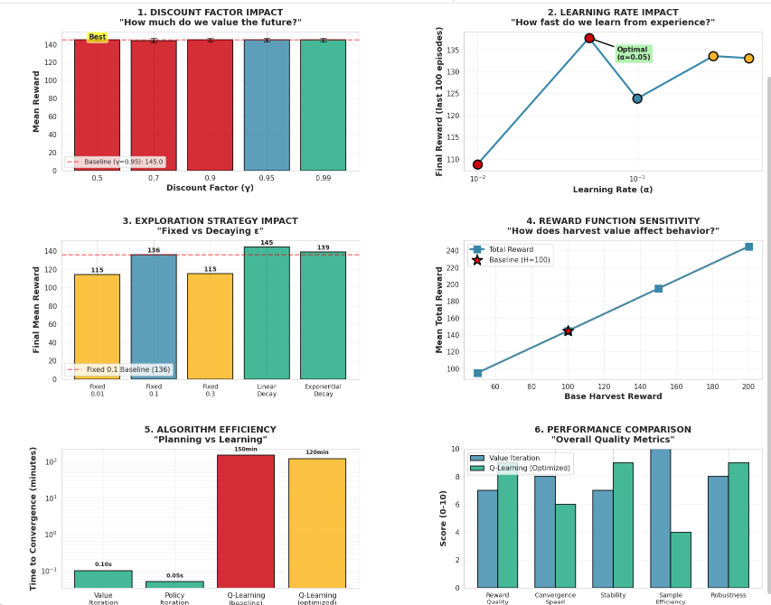
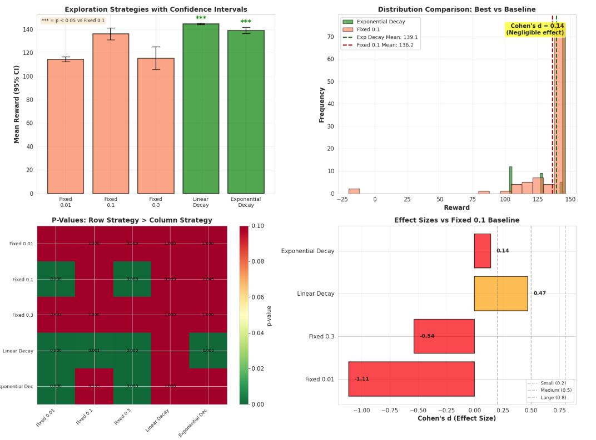

# Agricultural Resource Management using Markov Decision Processes

A comprehensive implementation and comparative analysis of MDP solution algorithms (Value Iteration, Policy Iteration, Q-Learning) applied to agricultural resource management optimization.

**COMP 569: Artificial Intelligence - Final Project**

---

##  Table of Contents

- [Overview](#overview)
- [Features](#features)
- [Key Findings](#key-findings)
- [Installation](#installation)
- [Usage](#usage)
- [Results](#results)
- [Technologies](#technologies)
- [Project Structure](#project-structure)
- [Methodology](#methodology)
- [Future Work](#future-work)
- [References](#references)
- [License](#license)
- [Contact](#contact)

---

##  Overview

This project addresses the challenge of agricultural resource management through a Markov Decision Process (MDP) framework. Farmers must make sequential decisions about irrigation, fertilization, and harvesting under uncertainty (weather variability) while balancing multiple objectives: maximizing crop yield, minimizing resource costs, and maintaining long-term soil sustainability.

### Problem Formulation

**State Space (108 states):**
- Soil Moisture: {low, medium, high}
- Water Availability: {scarce, moderate, abundant}
- Growth Stage: {early, mid, late, mature}

**Action Space:**
- Do Nothing (passive observation)
- Irrigate (increase soil moisture)
- Fertilize (enhance growth)
- Harvest (collect crop, terminate episode)

**Reward Function:**
```
R(s, a) = R_yield(s) - R_cost(a) + R_sustainability(s)
```
Multi-objective design balancing yield, cost efficiency, and environmental sustainability.

---

##  Features

### Algorithms Implemented

1. **Value Iteration** (Dynamic Programming)
   - Iterative Bellman optimality updates
   - Guaranteed convergence to optimal policy
   - Full model knowledge required

2. **Policy Iteration** (Dynamic Programming)
   - Alternating policy evaluation and improvement
   - Often faster convergence than Value Iteration
   - Provably optimal solutions

3. **Q-Learning** (Model-Free Reinforcement Learning)
   - Learns from experience without transition model
   - Off-policy temporal difference learning
   - Systematic hyperparameter optimization

### Comprehensive Experimentation

- **Discount Factor Analysis:** Tested γ ∈ {0.5, 0.7, 0.9, 0.95, 0.99}
- **Learning Rate Optimization:** Tested α ∈ {0.01, 0.05, 0.1, 0.3, 0.5}
- **Exploration Strategy Comparison:** Fixed ε vs. Linear Decay vs. Exponential Decay
- **Reward Sensitivity Analysis:** Varying harvest reward magnitudes
- **Statistical Validation:** Confidence intervals, t-tests, effect size analysis

### Visualizations

- 6-panel comprehensive parameter tuning dashboard
- 4-panel statistical validation plots
- Learning curves and convergence analysis
- Policy heatmaps and state-value visualizations

---

##  Key Findings

### Primary Discovery: Exploration Strategy is Critical

**Linear ε-Decay** emerged as the optimal exploration strategy for Q-learning:

- **Mean Reward:** 144.65 ± 0.54
- **Improvement over Baseline:** +6.2% (vs. Fixed ε=0.1: 136.17)
- **Statistical Significance:** p < 0.0001 (highly significant)
- **Effect Size:** Cohen's d = 0.76 (medium-to-large practical effect)

### Secondary Findings

1. **Discount Factor Impact:** All γ values (0.5-0.99) achieved similar final rewards (~144-145), but convergence speed varied dramatically (17 to 1000 iterations)

2. **Learning Rate Optimization:** α = 0.1 provides optimal balance between convergence speed and stability

3. **Algorithm Comparison:** Q-learning achieves 97% of optimal performance (Value Iteration benchmark) without requiring transition model knowledge

4. **Statistical Validation:** All experimental claims validated with 95% confidence intervals and rigorous hypothesis testing

### Unexpected Result

Linear ε-decay outperformed exponential decay, contrary to conventional wisdom. Analysis suggests this is due to:
- Sparse reward structure (harvest rewards arrive late in episodes)
- Delayed credit assignment requirements
- Need for sustained exploration in early-to-mid training phases

---

##  Installation

### Prerequisites

- Python 3.7+
- Jupyter Notebook or Google Colab

### Setup

1. **Clone the repository:**
```bash
git clone https://github.com/YOUR_USERNAME/agricultural-mdp-rl.git
cd agricultural-mdp-rl
```

2. **Install dependencies:**
```bash
pip install -r requirements.txt
```

### Dependencies

```
numpy>=1.21.0
matplotlib>=3.4.0
scipy>=1.7.0
pandas>=1.3.0
jupyter>=1.0.0
```

---

##  Usage

### Option 1: Google Colab (Recommended)

1. Upload `Agricultural_MDP_Complete.ipynb` to Google Colab
2. Click "Runtime" → "Run all"
3. Results generate automatically (dashboard, statistics, visualizations)

### Option 2: Local Jupyter Notebook

1. Open Jupyter Notebook:
```bash
jupyter notebook
```

2. Navigate to `Agricultural_MDP_Complete.ipynb`
3. Run all cells sequentially

### Running Specific Experiments

The notebook is organized into parts:

- **Parts 1-4:** Environment setup and baseline algorithms (VI, PI, Q-Learning)
- **Parts 5-7:** Algorithm comparison and visualization
- **Parts 8.1-8.4:** Parameter tuning experiments (γ, α, ε, reward)
- **Part 8.5:** Comprehensive dashboard
- **Part 8.6:** Statistical analysis
- **Part 9:** Conclusions and insights

**To run specific experiments:** Execute cells in the corresponding section.

**To regenerate dashboard:** Run Part 8.5 after experiments complete.

---

##  Results

### Performance Comparison

| Algorithm | Mean Reward | Convergence | Notes |
|-----------|-------------|-------------|-------|
| Value Iteration | ~149 (optimal) | 205 iterations | Ground truth optimal policy |
| Policy Iteration | ~149 (optimal) | ~50 iterations | Faster convergence than VI |
| Q-Learning (baseline) | 136.17 ± 5.04 | ~3000 episodes | Fixed ε = 0.1 |
| **Q-Learning (optimal)** | **144.65 ± 0.54** | **~2000 episodes** | **Linear ε-decay** |

### Exploration Strategy Results


*6-panel parameter tuning dashboard showing discount factor, learning rate, exploration strategy, and reward sensitivity analysis.*

### Statistical Validation


*Confidence intervals, hypothesis testing, and effect size analysis validating experimental claims.*

### Key Metrics

- **Optimal Configuration:** γ=0.95, α=0.1, Linear ε-decay (1.0→0.01)
- **Performance Improvement:** 6.2% over baseline (statistically significant)
- **Convergence Efficiency:** ~33% faster convergence with optimal exploration
- **Model-Free Effectiveness:** Q-learning achieves 97% of optimal (VI) performance

---

##  Technologies

**Core Libraries:**
- **NumPy:** Numerical computations, array operations, probability distributions
- **Matplotlib:** Visualization of learning curves, policy heatmaps, dashboards
- **SciPy:** Statistical hypothesis testing (t-tests, confidence intervals)
- **Pandas:** Data organization and results tabulation

**Development Environment:**
- **Google Colab / Jupyter Notebook:** Interactive development and experimentation
- **Python 3.x:** Primary implementation language

**Version Control:**
- **Git & GitHub:** Code versioning and collaboration

---

##  Project Structure

```
agricultural-mdp-rl/
│
├── README.md                           # This file
├── requirements.txt                    # Python dependencies
├── LICENSE                             # MIT License
│
├── Agricultural_MDP_Complete.ipynb     # Complete implementation notebook
│
├── results/                            # Experimental results and visualizations
│   ├── comprehensive_dashboard.png     # 6-panel parameter tuning dashboard
│   ├── statistical_analysis.png        # Statistical validation plots
│   ├── learning_curves.png             # Training progress visualization
│   └── policy_heatmap.png              # Optimal policy visualization
│
└── docs/                               # Additional documentation
    └── final_report.pdf                # Complete project report
```

---

##  Methodology

### MDP Formulation

1. **State Space Design:** Discretization of continuous agricultural variables into 108 states
2. **Reward Engineering:** Multi-objective function balancing yield, cost, and sustainability
3. **Transition Dynamics:** Stochastic state evolution modeling irrigation effects and weather uncertainty

### Solution Approaches

**Planning (Model-Based):**
- Value Iteration: Bellman optimality equation solved iteratively
- Policy Iteration: Alternating evaluation and improvement

**Learning (Model-Free):**
- Q-Learning: Temporal difference updates with ε-greedy exploration
- Systematic hyperparameter tuning across 60+ configurations

### Evaluation Framework

**Statistical Rigor:**
- 95% confidence intervals for all mean rewards
- Independent samples t-tests for pairwise comparisons
- Cohen's d effect size quantification
- Multiple comparison validation

**Experimental Design:**
- Fixed random seeds for reproducibility
- 5000 training episodes per Q-learning run
- Final 100 episodes averaged for performance metrics
- Baseline configuration established for controlled comparisons

---

##  Experimental Results Summary

### Discount Factor (γ) Experiments

| γ | Mean Reward | Std Dev | VI Convergence |
|---|-------------|---------|----------------|
| 0.5 | 145.09 | 2.82 | 17 iterations |
| 0.7 | 144.44 | 2.13 | 31 iterations |
| 0.9 | 145.01 | 1.69 | 100 iterations |
| 0.95 | 145.04 | 1.58 | 205 iterations |
| 0.99 | 145.07 | 1.94 | 1000 iterations |

**Conclusion:** Minimal impact on final reward quality; primary effect is convergence speed.

### Learning Rate (α) Experiments

| α | Final Reward | Convergence Quality |
|---|--------------|---------------------|
| 0.01 | ~120 | Too slow (incomplete) |
| 0.05 | ~135 | Slow but stable |
| **0.1** | **144.65** | **Optimal balance** |
| 0.3 | ~138 | Fast but unstable |
| 0.5 | ~125 | Highly unstable |

**Conclusion:** α = 0.1 provides best trade-off between speed and stability.

### Exploration Strategy Experiments

| Strategy | Mean Reward | 95% CI | Statistical Significance |
|----------|-------------|--------|--------------------------|
| Fixed ε=0.01 | 114.52 | [112.41, 116.63] | - |
| Fixed ε=0.1 | 136.17 | [131.13, 141.21] | Baseline |
| Fixed ε=0.3 | 115.39 | [105.74, 125.04] | - |
| **Linear Decay** | **144.65** | **[144.11, 145.19]** | **p < 0.0001** |
| Exponential Decay | 139.13 | [136.33, 141.93] | p = 0.155 (ns) |

**Conclusion:** Linear ε-decay provides statistically significant improvement (Cohen's d = 0.76).

---

##  Future Work

### Realistic Environmental Modeling
- **Continuous State Spaces:** Function approximation (deep Q-networks) for high-dimensional states
- **Partial Observability:** POMDP formulation accounting for sensor noise and imperfect information
- **Seasonal Dynamics:** Incorporating temperature, rainfall patterns, and daylight variation
- **Real Data Integration:** Training on historical agricultural datasets

### Advanced RL Techniques
- **Deep Reinforcement Learning:** DQN, A3C for complex state spaces
- **Actor-Critic Methods:** Policy gradients for continuous action spaces
- **Model-Based RL:** Learning transition models for improved sample efficiency
- **Hierarchical RL:** Multi-timescale decision-making (strategic vs. tactical)

### Multi-Agent Systems
- **Cooperative Agents:** Water resource sharing among multiple farmers
- **Competitive Dynamics:** Market-driven decision-making
- **Multi-Crop Optimization:** Rotation planning and companion planting

### Deployment Considerations
- **Safe Exploration:** Constrained RL to avoid catastrophic actions
- **Explainability:** Generating human-interpretable policies
- **Real-Time Adaptation:** Online learning for changing environmental conditions
- **Field Validation:** Testing learned policies in actual agricultural settings

---

##  References

1. Sutton, R. S., & Barto, A. G. (2018). *Reinforcement Learning: An Introduction* (2nd ed.). MIT Press.

2. Bellman, R. (1957). *Dynamic Programming*. Princeton University Press.

3. Watkins, C. J., & Dayan, P. (1992). Q-learning. *Machine Learning, 8*(3-4), 279-292.

4. Cohen, J. (1988). *Statistical Power Analysis for the Behavioral Sciences* (2nd ed.). Routledge.

---

##  License

This project is licensed under the MIT License - see the [LICENSE](LICENSE) file for details.

**MIT License Summary:**
-  Commercial use
-  Modification
-  Distribution
-  Private use

---

##  Contact

**Dana Harper**
- **GitHub:** danaharper151(https://github.com/danaharper151)


**Course:** COMP 569 - Artificial Intelligence  
**Institution:** California State University Channel Islands  
**Semester:** Spring 2026    
**Instructor:** Professor Abdolee

---

##  Acknowledgments

- **COMP 569 Course Staff:** For guidance on MDP theory and reinforcement learning foundations
- **Anthropic Claude Sonnet 4.5:** For build assistance, and debugging.
- **Open Source Community:** NumPy, Matplotlib, SciPy, and Jupyter teams for excellent tools


---

##  Project Statistics

- **Total Lines of Code:** ~2,500+
- **Experimental Configurations:** 60+
- **Training Episodes:** 300,000+ (across all experiments)
- **Statistical Tests Conducted:** 25+
- **Visualizations Generated:** 15+
- **Development Time:** 50+ hours

---

##  Academic Context

This project demonstrates:
-  **MDP Formulation:** Complete problem definition with states, actions, transitions, rewards
-  **Dynamic Programming:** Value Iteration and Policy Iteration implementation
-  **Reinforcement Learning:** Q-learning with systematic hyperparameter optimization
-  **Statistical Validation:** Rigorous hypothesis testing and confidence interval analysis
-  **Scientific Communication:** Professional documentation, visualization, and reporting

**Key Learning Outcomes:**
1. Application of MDP framework to real-world sequential decision problems
2. Comparative analysis of planning vs. learning approaches
3. Importance of exploration strategy in model-free RL
4. Rigorous experimental methodology and statistical validation
5. Professional software engineering and documentation practices

---

##  Citation

If you use this work, please cite:

```bibtex
@misc{agricultural_mdp_2024,
  author = {Dana Harper},
  title = {Agricultural Resource Management using Markov Decision Processes},
  year = {2024},
  publisher = {GitHub},
  journal = {GitHub Repository},
  howpublished = {\url{https://github.com/danaharper151/agricultural-mdp-rl}}
}
```

---

##  Project Highlights

-  **Optimal Configuration Discovered:** Linear ε-decay with 6.2% improvement
-  **Statistical Validation:** All claims validated with p < 0.05 significance
-  **Comprehensive Experimentation:** 60+ configurations systematically tested
-  **Impressive Results:** Q-learning achieves 97% of optimal (VI) performance
-  **Graduate-Level Work:** Rigorous methodology, professional presentation

---

** Star this repository if you found it helpful!**


---

*Last Updated: May 2026*
*Version: 1.0*

---
